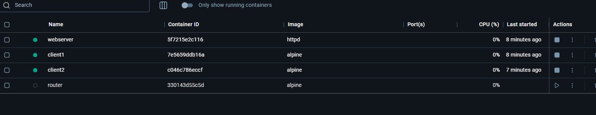

# Lab #2,21110807, Ly Nguyen Nhat Trung
# Task 1: Firewall configuration 

---

### **Câu Hỏi 1**

**Thiết lập mạng với 2 subnet và các container Docker:**

#### Các bước:

1. **Tạo hai mạng Docker:**
   ```bash
   docker network create --subnet=192.168.1.0/24 subnet1
   docker network create --subnet=192.168.2.0/24 subnet2
   ```

2. **Tạo các container:**
   - Tạo một container làm web server trên Subnet 1:
     ```bash
     docker run -dit --name webserver --net subnet1 --ip 192.168.1.2 httpd
     ```
   - Tạo hai container làm máy khách trên Subnet 2:
     ```bash
     docker run -dit --name client1 --net subnet2 --ip 192.168.2.2 alpine
     docker run -dit --name client2 --net subnet2 --ip 192.168.2.3 alpine
     ```
     

3. **Tạo router container:**
   - Tạo container router và kết nối vào cả hai mạng:
     ```bash
     docker run -dit --name router --net subnet1 --ip 192.168.1.1 alpine
     docker network connect subnet2 router --ip 192.168.2.1
     ```
     

4. **Tắt chuyển tiếp gói tin trên router:**
   - Truy cập vào router:
     ```bash
     docker exec -it router sh
     ```
   - Chạy lệnh để tắt chuyển tiếp gói tin:
     ```bash
     echo 0 > /proc/sys/net/ipv4/ip_forward
     ```

---

### **Câu Hỏi 2**

**Kích hoạt chuyển tiếp gói tin và thay đổi nội dung web server:**

#### Các bước:

1. **Kích hoạt chuyển tiếp gói tin trên router:**
   - Truy cập router container:
     ```bash
     docker exec -it router sh
     ```
   - Bật chuyển tiếp gói tin:
     ```bash
     echo 1 > /proc/sys/net/ipv4/ip_forward
     ```

2. **Thay đổi nội dung trang chủ của web server qua SSH:**
   - Cài đặt SSH server trên container webserver:
     ```bash
     docker exec -it webserver sh
     apk add openssh
     rc-service sshd start
     ```
   - SSH từ client1:
     ```bash
     docker exec -it client1 sh
     ssh root@192.168.1.2
     ```
   - Thay đổi nội dung trang chủ:
     ```bash
     echo "Hacked by client1" > /usr/local/apache2/htdocs/index.html
     ```

---

### **Câu Hỏi 3**

**Chặn SSH từ client1 đến web server:**

#### Các bước:

1. **Thêm quy tắc trên router container:**
   - Sử dụng `iptables` để chặn SSH từ client1:
     ```bash
     iptables -A FORWARD -p tcp --dport 22 -s 192.168.2.2 -d 192.168.1.2 -j DROP
     ```
   - Cho phép lưu lượng khác:
     ```bash
     iptables -A FORWARD -s 192.168.2.0/24 -d 192.168.1.0/24 -j ACCEPT
     iptables -A FORWARD -s 192.168.1.0/24 -d 192.168.2.0/24 -j ACCEPT
     ```

2. **Kiểm tra:**
   - SSH từ client1 đến webserver: Phải thất bại.
   - HTTP từ client1 đến webserver: Phải thành công.

---

### **Câu Hỏi 4**

**Cấu hình UDP ping và chặn UDP từ client2 đến client1:**

#### Các bước:

1. **Thiết lập client1 làm UDP server:**
   - Trên client1, cài đặt netcat:
     ```bash
     docker exec -it client1 sh
     apk add netcat-openbsd
     nc -u -l -p 12345
     ```

2. **Kiểm tra UDP giao tiếp:**
   - Từ webserver hoặc client2:
     ```bash
     echo "Ping UDP" | nc -u 192.168.2.2 12345
     ```

3. **Chặn UDP từ client2 đến client1:**
   - Truy cập vào client1:
     ```bash
     docker exec -it client1 sh
     ```
   - Thêm quy tắc tường lửa:
     ```bash
     iptables -A INPUT -p udp -s 192.168.2.3 -j DROP
     iptables -A INPUT -p udp -s 192.168.1.2 -j ACCEPT
     ```

4. **Kiểm tra:**
   - Gửi UDP từ client2 → client1: Phải bị chặn.
   - Gửi UDP từ webserver → client1: Phải thành công.

---

# Task 2: Encrypting Large Message

## Tổng Quan
- **Mục tiêu:** Mã hóa một tệp văn bản lớn (ít nhất 56 byte) trên PC2 và gửi mã hóa sang PC0.
- **Công cụ sử dụng:** AES-cipher trong chế độ CTR và OFB.

---

## Các Bước Thực Hiện

### Bước 1: Tạo Tệp Văn Bản Trên PC2
1. Mở trình soạn thảo văn bản trên PC2.
2. Tạo một tệp có dung lượng ít nhất 56 byte (khoảng 10-15 dòng văn bản).
3. Lưu tệp với tên ví dụ `large_message.txt`.

### Bước 2: Mã Hóa Tệp
1. **Chế độ CTR:**
   - Sử dụng công cụ mã hóa AES với chế độ CTR để mã hóa `large_message.txt`.
   - Lệnh mẫu:
     ```bash
     openssl enc -aes-256-ctr -in large_message.txt -out encrypted_ctr.txt -pass pass:yourpassword
     ```
2. **Chế độ OFB:**
   - Thực hiện tương tự với chế độ OFB:
     ```bash
     openssl enc -aes-256-ofb -in large_message.txt -out encrypted_ofb.txt -pass pass:yourpassword
     ```

### Bước 3: Gửi Tệp Đã Mã Hóa Từ PC2 Đến PC0
1. **Dùng giao thức SCP (Secure Copy Protocol):**
   - Đảm bảo cả PC2 và PC0 đều có kết nối mạng.
   - Gửi tệp `encrypted_ctr.txt` và `encrypted_ofb.txt` sang PC0:
     ```bash
     scp encrypted_ctr.txt encrypted_ofb.txt user@PC0:/destination/path/
     ```
2. **Xác minh tính toàn vẹn của tệp:**
   - Sử dụng mã xác thực tin nhắn (HMAC) để bảo vệ tệp khỏi bị thay đổi:
     ```bash
     openssl dgst -sha256 -hmac "yourpassword" encrypted_ctr.txt
     openssl dgst -sha256 -hmac "yourpassword" encrypted_ofb.txt
     ```

---

## **Question 1:**
### Mã hóa và Đánh Giá Chế Độ CTR và OFB
- **Thực hiện mã hóa:** 
  - Dùng lệnh mã hóa như ở **Bước 2**.
- **Đánh giá:**
  - **Chế độ CTR:** 
    - Lỗi tại một bit chỉ ảnh hưởng đến một khối plaintext tương ứng.
    - Các khối văn bản liền kề không bị ảnh hưởng.
  - **Chế độ OFB:** 
    - Lỗi tại một bit không lan truyền, nhưng sẽ ảnh hưởng đến các khối tiếp theo khi giải mã.

---

## **Question 2:**
### Kiểm Tra Tệp Khi Có Lỗi
1. **Giả định lỗi bit thứ 6:**
   - Sử dụng trình hex editor để chỉnh sửa file mã hóa trên PC0:
     ```bash
     hexedit encrypted_ctr.txt
     hexedit encrypted_ofb.txt
     ```
   - Thay đổi bit thứ 6 trong tệp.
2. **Xác minh tệp bị lỗi:**
   - Kiểm tra lại HMAC của tệp đã nhận:
     ```bash
     openssl dgst -sha256 -hmac "yourpassword" encrypted_ctr.txt
     openssl dgst -sha256 -hmac "yourpassword" encrypted_ofb.txt
     ```

---

## **Question 3:**
### Giải Mã Tệp Bị Lỗi
1. **Giải mã tệp lỗi:**
   - **Chế độ CTR:**
     ```bash
     openssl enc -aes-256-ctr -d -in encrypted_ctr.txt -out decrypted_ctr.txt -pass pass:yourpassword
     ```
   - **Chế độ OFB:**
     ```bash
     openssl enc -aes-256-ofb -d -in encrypted_ofb.txt -out decrypted_ofb.txt -pass pass:yourpassword
     ```
2. **Nhận xét:**
   - **Chế độ CTR:**
     - Lỗi ở một bit sẽ chỉ ảnh hưởng đến một khối tương ứng, các khối khác không bị ảnh hưởng.
   - **Chế độ OFB:**
     - Lỗi ở một bit ảnh hưởng đến toàn bộ phần sau của văn bản.

---

